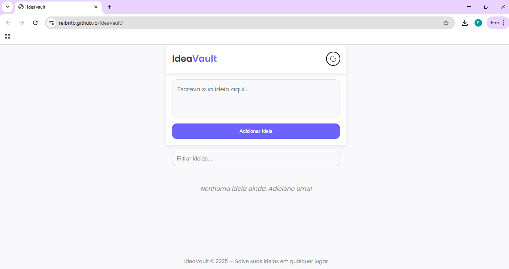

# 💡 IdeaVault — Cofre Digital de Ideias

O **IdeaVault** é um aplicativo leve, rápido e intuitivo para armazenar e organizar suas ideias em qualquer lugar.  
Com ele, você pode anotar pensamentos criativos, projetos futuros ou lembretes importantes, manter tudo salvo localmente no seu dispositivo e até instalar como um **PWA (Progressive Web App)** para ter uma experiência de app nativo.

---

## ✨ Principais Recursos

- 📝 Adicione ideias de forma simples e rápida  
- 🔍 Filtre suas anotações para encontrar o que precisa  
- 🎨 Suporte a **modo claro/escuro**  
- 📱 Funciona offline com **Service Worker**  
- 📂 Armazenamento local seguro (sem depender de servidor)  
- 🚀 Instalação como aplicativo (PWA) em celular ou desktop  

O **IdeaVault** é perfeito para criativos, empreendedores, estudantes e qualquer pessoa que não quer perder aquela ideia valiosa.  

---

## 🚀 Tecnologias Utilizadas

- **HTML5** → Estrutura da aplicação  
- **CSS3** → Estilização moderna e responsiva  
- **JavaScript (ES6)** → Lógica de funcionamento e manipulação dinâmica do DOM  
- **PWA (Progressive Web App)** → Suporte offline e instalação como app  
- **Service Worker** → Cache e funcionamento offline  
- **LocalStorage** → Armazenamento de ideias no navegador

---

## 📂 Estrutura do Projeto

```
├── index.html        # Estrutura principal
├── styles.css        # Estilos e responsividade
├── script.js         # Lógica da aplicação
├── manifest.json     # Configuração PWA
├── service-worker.js # Suporte offline
└── icons/            # Ícones do app
```

---

## ⚡ Como Usar Localmente

1. Clone este repositório:
   ```bash
   git clone https://github.com/ReiBrito/IdeaVault.git
   ```

2. Acesse a pasta do projeto:
   ```bash
   cd IdeaVault
   ```

3. Abra o arquivo `index.html` no navegador:
   ```bash
   start index.html   # Windows
   open index.html    # Mac
   xdg-open index.html # Linux
   ```

4. Comece a salvar suas ideias de forma rápida e prática.

---

## 🌐 Domostração

Acesse o link para testar 👉 https://ReiBrito.github.io/IdeaVault/

---

## 🖼️ Imagens

Tema Claro 


Tema Dark 


---

## 📌 Melhorias Futuras

- ☁️ Sincronização em nuvem (multi-dispositivo)  
- 🗂️ Categorias e tags para ideias  
- 📤 Exportar ideias em PDF/Markdown  
- 🔔 Lembretes e notificações

---

## 👨‍💻 Autor

Desenvolvido por **[Reinaldo Brito](https://github.com/ReiBrito)** 💙  
Sinta-se livre para contribuir ou adaptar ao seu uso!
